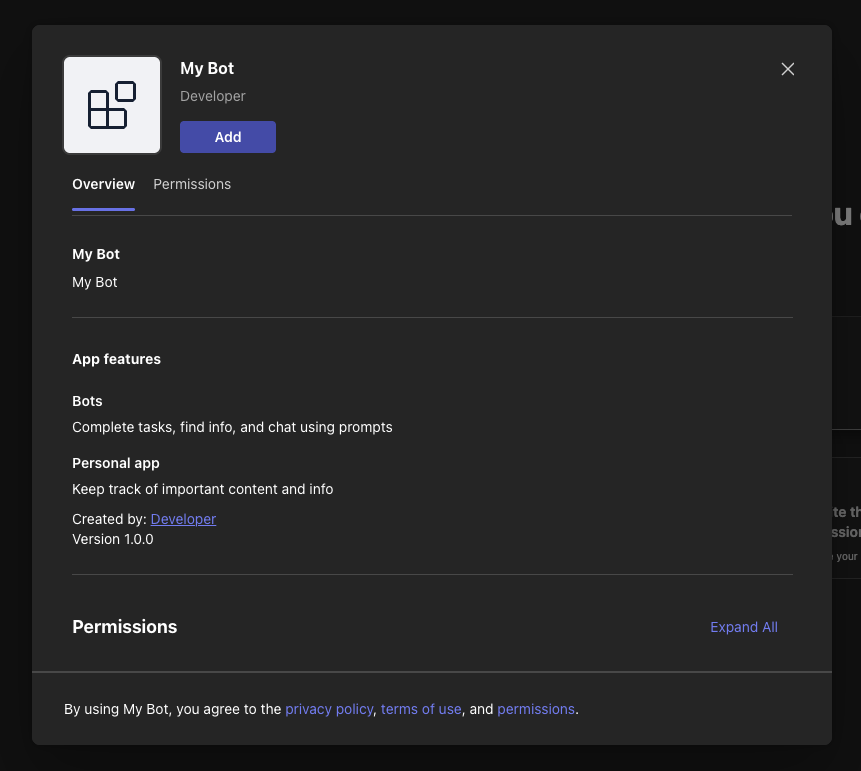
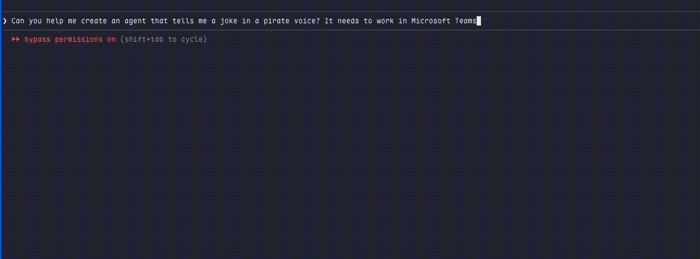

You want to build a Teams agent. Maybe it answers customer questions from a knowledge base. Maybe it runs your team's standups. The interesting part is the logic, the thing the agent actually *does*.

But before you write a single line of that logic, you have to register it with Teams. And that's where the day goes sideways.

<!-- truncate -->

## The Setup Tax

<div style={{textAlign: 'center'}}>

</div>

That's a lot of steps across the Azure portal, Developer Portal, and your editor before your agent handles its first message. Each step is individually straightforward. The problem is the compound cost: too many portals, too many copy-pastes, and too many concepts between you and a working agent.

At best, this takes 30 minutes. At worst, something doesn't work and you're left retracing every step to find the one that went wrong.

## The Teams CLI Preview

We updated our CLI (v3 preview) to make this simpler. Install it and log in:

```bash
npm install -g @microsoft/teams.cli@preview
teams login
```

### Create Is Now Just One Command

```bash
teams app create --name "My Bot" --endpoint https://my-bot.example.com/api/messages --env .env
```

`teams app create` does the heavy lifting (registration, credentials, manifest, and more) so you can start building immediately. All the steps from above happen behind the scenes.


Now you can focus on your agent's logic without worrying about app registration concepts. See the [CLI docs](/cli/) for all available flags.

### Easy Installation

Traditionally, getting an agent into Teams means building an app package, managing a manifest, and sideloading it. With the CLI, `app create` gives you an installation link. Open it and Teams handles the install flow without a manual zip/package upload.



The CLI also includes a `teams app doctor` command that checks your agent's registration, credentials, endpoint, and manifest so when something breaks, you know exactly what to fix.

## Let Your Coding Agent Handle It

The CLI also ships with a [`teams-dev` agent skill](/developer-tools/agent-skills) for AI coding agents like Copilot, Claude Code, and Cursor. Instead of running commands yourself, tell your assistant:

- *"Help me build a Teams agent that answers FAQs"*
- *"Get my agent running in Teams"*
- *"My agent isn't loading in Teams, can you help?"*



The skill uses the CLI under the hood to handle the full infrastructure workflow, from login to a working agent in Teams, and troubleshooting when something breaks. Beyond infrastructure, it also helps your coding agent write application logic following best practices from the Teams SDK documentation.

For CI pipelines and custom tooling, every CLI command supports `--json` output for programmatic consumption.

## Get Started

```bash
npm install -g @microsoft/teams.cli@preview
```

Full docs at [microsoft.github.io/teams-sdk/cli](https://microsoft.github.io/teams-sdk/cli/). File issues at [github.com/microsoft/teams-sdk](https://github.com/microsoft/teams-sdk/issues).
