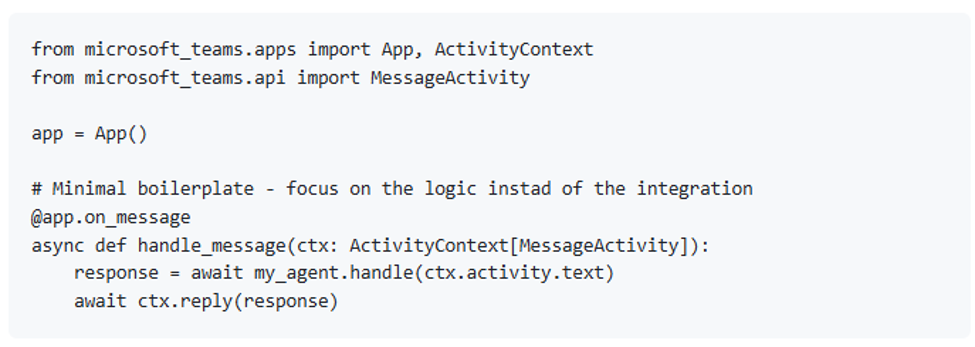

We’re excited to announce that Python support in the Microsoft Teams SDK is now Generally Available (GA).

<!-- truncate -->

With the Teams SDK, developers have a production ready foundation for building intelligent collaboration centric experiences directly within Microsoft Teams. And starting today, Python developers can take full advantage of that platform, using the same SDK surface that powers modern Teams apps and agents. You can learn more about the Python release of the Teams SDK in our [documentation](https://microsoft.github.io/teams-sdk/python/getting-started/)

## Bringing Python to the Teams Platform

The Teams SDK was built to bring speed, clarity, and delight back to your development experience. The simplified and streamlined Teams SDK enhancements now extend to our developers using Python.

With Python now supported in the Teams SDK, developers can build Teams native intelligent apps and agents [AJ2.1][RC2.2][RC2.3]with pythonic patterns. This allows developers to jump in quickly with their natural Python development flow.
This means your orchestration logic, reasoning layer, workflow automation, or domain specific copilots can now:

- Participate directly in Teams conversations
- Integrate seamlessly into your existing server or LLM agent
- Respond to user prompts and contextual inputs
- Deliver streaming or card based experiences
- Notify users proactively
- Collaborate within shared communication spaces
- Integrate directly into chats, channels, and meetings

## Start Building with Python and Teams SDK Today

With GA support for Python in the Microsoft Teams SDK, developers now have a direct path to extend intelligent services into one of the world’s most widely used collaboration platforms.

- **Follow the Quick Start guide:** You can create a new Teams agent in seconds using the Python release of the Teams SDK, our [documentation](https://microsoft.github.io/teams-sdk/python/getting-started/) will guide you through it step by step
- **See an example:** Our Teams sample inventory can help you dig deeper into the code to learn more via a hands-on experience. You can see our quick start sample for Python [here](https://github.com/OfficeDev/Microsoft-Teams-Samples/tree/main/samples/TeamsSDK/bot-quickstart/python/bot-quickstart)
- **Join the Community:** We’re building this for and with a community of developers. Join the discussions in the Microsoft 365 Developer Forum, share your agent ideas or ask questions on Stack Overflow, and follow our updates on the Teams developer blog. Your feedback will help shape future releases—please report any issues you may experience [here](https://aka.ms/NewIssue)

We’re excited to see what you build!
