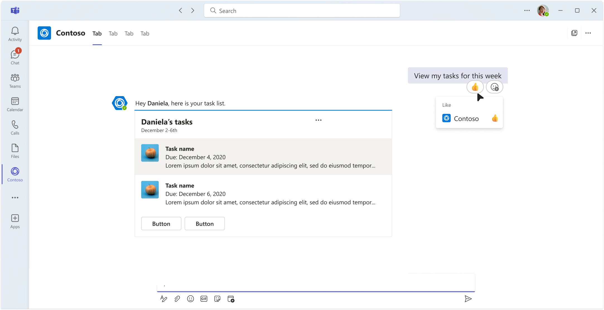

**Public Preview | May 2026**

Your Teams agents can now react to messages with emojis. You can acknowledge, confirm, celebrate, and listen without sending an extra message reply. Agent message reactions are available today in public preview across .NET, TypeScript, and Python.

<div style={{textAlign: 'center'}}>

</div>

<!-- truncate -->

## The Problem: Messages Can Be Too Noisy

Every interaction your agent has today requires a new message to be sent, yet another reply cluttering an already busy thread.

Meanwhile, humans communicate volumes with a single 👍.

Agent reactions bridge that gap. Your agent can now participate in the lightweight, non-verbal layer of conversation that makes Teams collaboration feel natural.

## What You Can Do

| Capability | Description |
| --- | --- |
| Add reactions | React to any message your agent can see - 1:1, group chat, or channel |
| Remove reactions | Programmatically remove reactions as context changes |
| Receive reaction events | Get notified when users react to your agent's messages |
| Teams Reaction Reference | Discover all available emojis and their skin tone variants |


## Real-World Scenarios

### 1. Instant Acknowledgment

Agents can react to a request with a simple 👍 ```(like)```. No additionl messages, and users know their request has been heard

### 2. Progress Signaling

Agents can react to acknowledge a request, then swap their reaction to a different one signaling their work has been completed. Agent tasks run in the background without additional thread noise.

Below is an example of an agent reacting to a message with ⌛ ```holdon```, then swapping that for a ✅ ```2705_whiteheavycheckmark``` when the task is complete.

```csharp
// Acknowledge user request and notify them work has commenced with an hourglass "holdon" emoji
// Add reaction to message
    await context.Api.Conversations.Reactions.AddAsync(
        context.Activity.Conversation.Id,
        context.Activity.Id,
        new ReactionType("holdon"),
        cancellationToken
    );

// ... task completes ...

// Swap to checkmark emoji to indicate task completion
// Remove previously added hourglass "holdon" emoji
    await context.Api.Conversations.Reactions.DeleteAsync(
        context.Activity.Conversation.Id,
        context.Activity.Id,
        new ReactionType("holdon"),
        cancellationToken
    );

// Add new checkmark '2705_whiteheavycheckmark" reaction to signal work is complete
    await context.Api.Conversations.Reactions.AddAsync(
        context.Activity.Conversation.Id,
        context.Activity.Id,
        new ReactionType("2705_whiteheavycheckmark"),
        cancellationToken
    );
```

### 3. Silent Celebrations

Agent monitors a channel for deployments, launches, or other celebratory events and joins in by reacting with 🥳 ```party```.

## Adding a Reaction

Below are examples of adding 👍 ```like``` reactions to messages in each language:

### TypeScript

```typescript
// Add a reaction
app.on('message', async ({ activity, api, send }) => {
  await send("Hello! I'll react to this message.");
  await api.conversations.reactions.add(activity.conversation.id, activity.id, 'like');
});
```

### .NET

```csharp
// Add a reaction
app.OnMessage(async context =>
{
    // First, add a reaction
    await context.Api.Conversations.Reactions.AddAsync(
        context.Activity.Conversation.Id,
        context.Activity.Id,
        new ReactionType("like")
    );
});

```

### Python

```python
# Add a reaction
@app.on_message
async def handle_message(ctx: ActivityContext[MessageActivity]):
    await ctx.api.conversations.reactions.add(
        ctx.activity.conversation.id,
        ctx.activity.id,
        'like'
    )
```

## Removing a Reaction

The pattern for reaction removal is standardized across languages. Below are examples of removing the 👍 ```like``` reaction from a message in each language:

### TypeScript

```typescript
// Remove a reaction
app.on('message', async ({ activity, api, send }) => {
  await send("Hello! I'll react to this message.");
  await api.conversations.reactions.delete(activity.conversation.id, activity.id, 'like');
});
```

### .NET

```csharp
// Remove a reaction
app.OnMessage(async context =>
{
    await context.Api.Conversations.Reactions.DeleteAsync(
        context.Activity.Conversation.Id,
        context.Activity.Id,
        new ReactionType("like")
    );
})
```

### Python

```python
# Remove a reaction
@app.on_message
async def handle_message(ctx: ActivityContext[MessageActivity]):
    await ctx.api.conversations.reactions.delete(
        ctx.activity.conversation.id,
        ctx.activity.id,
        'like'
    )
```

## Listening to Reactions

You can also listen for reactions being added or removed from messages your agent has sent. Below are examples of listening for incoming and removed reactions in each language: 

### TypeScript

```typescript
// Listen for a reaction added to agent message
app.on('messageReaction', async ({ activity }) => {
  for (const reaction of activity.reactionsAdded ?? []) {
    console.log(`User added reaction: ${reaction.type}`);
  }
```
```typescript
// Listen for a reaction removed from agent message
  for (const reaction of activity.reactionsRemoved ?? []) {
    console.log(`User removed reaction: ${reaction.type}`);
  }
});
```

### .NET

```csharp
// Listen for a reaction added to agent message
app.OnMessageReactionAdded(async (context, cancellationToken) =>{
    foreach (var reaction in context.Activity.ReactionsAdded ?? []){
        Console.WriteLine($"User added reaction: {reaction.Type}");
    }
});
```
```csharp

// Listen for a reaction removed from agent message
app.OnMessageReactionRemoved(async (context, cancellationToken) =>{
    foreach (var reaction in context.Activity.ReactionsRemoved ?? []){
        Console.WriteLine($"User removed reaction: {reaction.Type}");
    }
});
```

### Python

```python
# Listen for a reaction added to agent message
@app.on_message_reaction
async def handle_reaction(ctx: ActivityContext[MessageReactionActivity]):
    for reaction in ctx.activity.reactions_added or []:
        print(f"User added reaction: {reaction.type}")
```
```python
# Listen for a reaction removed from agent message
@app.on_message_reaction
async def handle_reaction(ctx: ActivityContext[MessageReactionActivity]):
# Listen for a reaction removed from agent message
    for reaction in ctx.activity.reactions_removed or []:
        print(f"User removed reaction: {reaction.type}")
```

## Reaction IDs (EmojiIDs)

When using emojis as reactions in Teams you must use the Teams specific EmojiID to identify the correct emoji you'd like to send. Below are some examples of EmojiIDs:

| EmojiID | Emoji | Diverse (skin tones) |
| --- | --- | --- |
| `like` | 👍 | No |
| `heart` | ❤️ | No |
| `happyface` | 😊 | No |
| `grinningfacewithsmilingeyes` | 😄 | No |
| `1f603_grinningfacewithbigeyes` | 😃 | No |
| `1f44b_wavinghand` | 👋 | Yes |
| `1f590_handwithfingerssplayed` | 🖐️ | Yes |
| `1f91a_raisedbackofhand` | 🤚 | Yes |

Skin-tone variants are supported via suffix modifiers:

- `1f44b_wavinghand-tone1`
- `1f44b_wavinghand-tone2`
- `1f44b_wavinghand-tone3`
- `1f44b_wavinghand-tone4`
- `1f44b_wavinghand-tone5`

## Teams Reactions Reference

Alongside this preview, we're publishing the [**Teams Reactions Reference**](https://learn.microsoft.com/microsoftteams/platform/agents-in-teams/teams-reactions-reference). This page was created as a developer resource for discovering all thevalid EmojiIDs supported by Teams.

The reference includes:

- Complete catalog of supported EmojiIDs organized by category (Smileys, Hand gestures, etc.)
- Skin-tone variations for diverse emojis

We're continuously adding new capabilites and features based on your feedback. We're excited to release this capability to you and can't wait to see what you build!🎉
