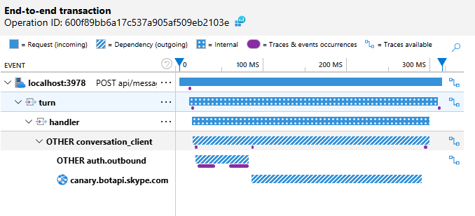
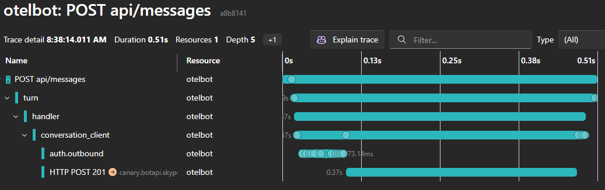
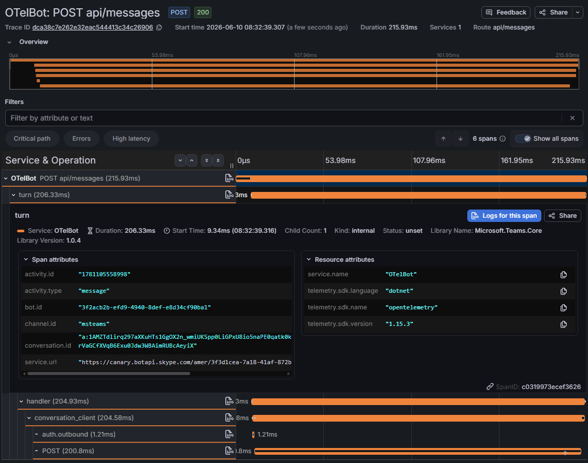

Teams SDK for .NET 2.1 Preview adds OpenTelemetry-friendly observability to the ASP.NET Core hosting model, so your bot or agent can emit correlated traces, metrics, and logs that your application routes to Azure Monitor / Application Insights, OTLP-based local tooling, or both. The SDK emits the telemetry; your app decides whether to listen, how to enrich it, and where to send it.

<!-- truncate -->

## Why This Matters

A single user message can trigger middleware, handler dispatch, token acquisition, outbound Bot Service calls, and downstream service requests. When something goes wrong — or just runs slow — isolated log lines are not enough. You need to see the full turn, end to end.

The Teams SDK now instruments its pipeline through standard .NET primitives — `ActivitySource`, `Meter`, and `ILogger` — so you get:

- **Correlated traces** across the full turn lifecycle: middleware, handler, auth, outbound calls
- **Metrics** for activity volume, turn latency, handler errors, and outbound call health
- **Structured logs** that automatically carry `TraceId` and `SpanId`, so you can pivot from a trace to its log lines

This is not proprietary instrumentation. It is the same [OpenTelemetry model](https://learn.microsoft.com/dotnet/core/diagnostics/observability-with-otel) that the rest of the .NET ecosystem uses.

## How It Works: SDK Emits, Your App Opts In

The SDK follows the .NET [library instrumentation guidance](https://learn.microsoft.com/dotnet/core/diagnostics/distributed-tracing-instrumentation-walkthroughs): libraries produce telemetry through `ActivitySource` and `Meter`; applications choose collection and export. The SDK does **not** automatically phone home or force a specific backend — your app controls everything.


The only Teams-specific wiring is registering the SDK's source and meter names. Here is the relevant excerpt from the [OTelBot sample](https://github.com/microsoft/teams-agent-accelerator-templates/tree/main/dotnet/OTelBotWithAspire)'s service defaults:

```csharp
using Microsoft.Teams.Apps.Diagnostics;
using Microsoft.Teams.Core.Diagnostics;

builder.Services.AddOpenTelemetry()
    .WithTracing(tracing =>
    {
        tracing.AddAspNetCoreInstrumentation()
            .AddHttpClientInstrumentation();
        tracing.AddSource([CoreTelemetryNames.ActivitySourceName,
                           TeamsBotApplicationTelemetry.ActivitySourceName]);
    })
    .WithMetrics(metrics =>
    {
        metrics.AddAspNetCoreInstrumentation()
            .AddHttpClientInstrumentation()
            .AddRuntimeInstrumentation();
        metrics.AddMeter([CoreTelemetryNames.MeterName,
                          TeamsBotApplicationTelemetry.MeterName]);
    });

builder.Logging.AddOpenTelemetry(logging =>
{
    logging.IncludeFormattedMessage = true;
    logging.IncludeScopes = true;
});
```

The `AddSource` / `AddMeter` calls are the only Teams-specific lines. Auto-instrumentation for ASP.NET Core and `HttpClient` fills in the rest — inbound HTTP spans, outbound API calls, and everything in between.

With this configuration, the bot's `Program.cs` stays minimal:

```csharp
using Microsoft.Teams.Apps;

WebApplicationBuilder builder = WebApplication.CreateBuilder(args);
builder.AddServiceDefaults();
builder.Services.AddTeamsBotApplication();
WebApplication app = builder.Build();

TeamsBotApplication bot = app.UseTeamsBotApplication();

bot.OnMessage(async (ctx, ct) =>
{
    string? message = ctx.Activity.TextWithoutMentions;
    await ctx.SendActivityAsync($"Echo: {message}", ct);
});

app.MapDefaultEndpoints();
app.Run();
```

`AddServiceDefaults()` configures OpenTelemetry, health checks, and service discovery — all through the standard [.NET Aspire service defaults](https://learn.microsoft.com/dotnet/aspire/fundamentals/service-defaults) pattern.

## What the SDK Instruments

Every turn produces a trace with this shape:

```
HTTP server span                       (auto — ASP.NET Core)
└─ turn                                (Microsoft.Teams.Core)
   ├─ middleware [n times]             (Microsoft.Teams.Core)
   ├─ handler                          (Microsoft.Teams.Apps)
   └─ conversation_client              (Microsoft.Teams.Core)
      ├─ auth.outbound                 (Microsoft.Teams.Core)
      │  └─ HTTP client span           (auto — token endpoint)
      └─ HTTP client span              (auto — Bot Service API)
```

The `turn` span carries activity type, conversation ID, and channel ID. Spans from auto-instrumented libraries — HTTP clients, Azure SDKs, AI model calls — appear as children automatically.

The SDK also exposes counters and histograms:

| Metric | Type | What it tells you |
| --- | --- | --- |
| `teams.activities.received` | Counter | How many activities your bot is processing |
| `teams.turn.duration` | Histogram | End-to-end turn latency |
| `teams.handler.errors` | Counter | Unhandled exceptions in handlers |
| `teams.middleware.duration` | Histogram | Per-middleware execution time |
| `teams.outbound.calls` | Counter | Calls to the Bot Service API |
| `teams.outbound.errors` | Counter | Failed outbound calls |

## See Every Turn in Application Insights

To additionally export to [Application Insights](https://learn.microsoft.com/azure/azure-monitor/app/opentelemetry-enable), set the `APPLICATIONINSIGHTS_CONNECTION_STRING` environment variable. The sample's service defaults detect this and call `UseAzureMonitor()` automatically:

```csharp
if (!string.IsNullOrEmpty(builder.Configuration["APPLICATIONINSIGHTS_CONNECTION_STRING"]))
{
    builder.Services.AddOpenTelemetry().UseAzureMonitor();
}
```

In the portal, you can inspect each turn end-to-end — from the inbound request through middleware, handler dispatch, token acquisition, and outbound Bot Service calls — all in a single correlated trace view:



> **Tip:** If multiple bots or services emit to the same Application Insights resource, set `service.name` and `service.namespace` via `ConfigureResource` so the [Application Map](https://learn.microsoft.com/azure/azure-monitor/app/app-map) separates them correctly.

## Debug Locally with OTLP

The same telemetry works with any OTLP-compatible backend for local development.

**[.NET Aspire](https://learn.microsoft.com/dotnet/aspire/fundamentals/dashboard/standalone)** — the sample includes an Aspire AppHost that orchestrates the bot and automatically provides a dashboard with traces, metrics, and structured logs:

```csharp
// OTelBotWithAspire.AppHost/AppHost.cs
IDistributedApplicationBuilder builder = DistributedApplication.CreateBuilder(args);
builder.AddProject<Projects.OTelBot>("otelbot");
builder.Build().Run();
```

Run the AppHost project and the Aspire Dashboard opens automatically:



**[Grafana LGTM](https://github.com/grafana/docker-otel-lgtm)** — alternatively, set `OTEL_EXPORTER_OTLP_ENDPOINT` to point at a Grafana LGTM container:

```bash
docker run --rm -d --name lgtm \
  -p 3000:3000 -p 4317:4317 -p 4318:4318 \
  grafana/otel-lgtm

export OTEL_EXPORTER_OTLP_ENDPOINT=http://localhost:4317
dotnet run
```

Here is the same turn in Grafana Tempo — the span waterfall with span attributes showing `activity.type`, `activity.id`, `conversation.id`, `channel.id`, and the `Microsoft.Teams.Core` library name:



## Try It

The full [OTelBotWithAspire sample](https://github.com/microsoft/teams-agent-accelerator-templates/tree/main/dotnet/OTelBotWithAspire) is a ready-to-run Aspire solution with three projects:

| Project | Purpose |
| --- | --- |
| `OTelBot` | The Teams bot — 18 lines of `Program.cs` |
| `OTelBotWithAspire.ServiceDefaults` | OpenTelemetry, health checks, and service discovery configuration |
| `OTelBotWithAspire.AppHost` | Aspire orchestrator that launches the bot with the dashboard |

Clone it and run the AppHost to see traces, metrics, and correlated logs for every turn.

For the complete setup guide including standalone (non-Aspire) configuration, resource attributes, sampling, and a full `Program.cs` example, see the [OpenTelemetry in-depth guide](/csharp/in-depth-guides/observability/opentelemetry).

We'd love your feedback on the observability experience. File issues on the [GitHub repository](https://github.com/microsoft/teams-sdk).
