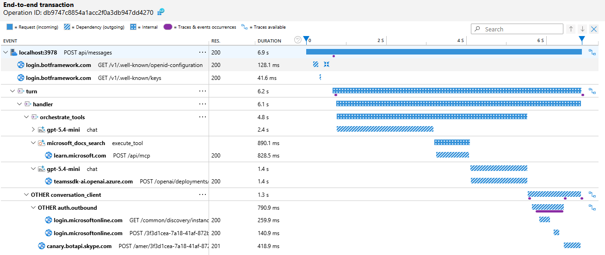

Teams SDK for .NET 2.1 Preview now emits OpenTelemetry traces, metrics, and correlated logs. Route them to Azure Monitor / Application Insights, a local OTLP collector, or both — the SDK emits the telemetry; your app decides where it goes.

<!-- truncate -->

## Why This Matters

A single user message can trigger middleware, handler dispatch, token acquisition, outbound Bot Service calls, and downstream service requests. When something goes wrong — or just runs slow — isolated log lines are not enough. You need to see the full turn, end to end.

The Teams SDK now instruments its pipeline through standard .NET primitives — `ActivitySource`, `Meter`, and `ILogger`. This is not proprietary instrumentation — it is the same [OpenTelemetry model](https://learn.microsoft.com/dotnet/core/diagnostics/observability-with-otel) that the rest of the .NET ecosystem uses. The SDK follows the .NET [library instrumentation guidance](https://learn.microsoft.com/dotnet/core/diagnostics/distributed-tracing-instrumentation-walkthroughs): **libraries produce telemetry; applications choose collection and export.**


## Two Lines of Teams-Specific Code

The only Teams-specific wiring is registering the SDK's `ActivitySource` and `Meter` names:

```csharp
tracing.AddSource(new[] { CoreTelemetryNames.ActivitySourceName,
                          TeamsBotApplicationTelemetry.ActivitySourceName });

metrics.AddMeter(new[] { CoreTelemetryNames.MeterName,
                         TeamsBotApplicationTelemetry.MeterName });
```

Everything else — ASP.NET Core and `HttpClient` auto-instrumentation, exporters, logging — is standard OpenTelemetry .NET setup. With [.NET Aspire service defaults](https://learn.microsoft.com/dotnet/aspire/fundamentals/service-defaults), your bot's `Program.cs` stays minimal:

```csharp
WebApplicationBuilder builder = WebApplication.CreateBuilder(args);
builder.AddServiceDefaults(); // configures OpenTelemetry, health checks, service discovery
builder.Services.AddTeamsBotApplication();
WebApplication app = builder.Build();

TeamsBotApplication bot = app.UseTeamsBotApplication();

bot.OnMessage(async (ctx, ct) =>
{
    string? message = ctx.Activity.TextWithoutMentions;
    await ctx.SendActivityAsync($"Echo: {message}", ct);
});

app.MapDefaultEndpoints();
app.Run();
```

## What You See

In Application Insights, you can inspect each turn end-to-end — from the inbound request through middleware, handler dispatch, token acquisition, and outbound Bot Service calls:


The same telemetry works locally with any OTLP-compatible backend. The sample includes an Aspire AppHost — run it and the dashboard opens automatically:


For bots that call AI models through [`Microsoft.Extensions.AI`](https://learn.microsoft.com/dotnet/ai/ai-extensions), you get the full chain — from the inbound message, through chat completions and MCP tool calls, and back out through the Bot Service response:



## Try It

Two samples are available to get started:

| Sample | What it shows |
| --- | --- |
| [OTelBotWithAspire](https://github.com/microsoft/teams-agent-accelerator-templates/tree/main/dotnet/OTelBotWithAspire) | Echo bot with Aspire service defaults and dashboard |
| [AIBotWithOTel](https://github.com/microsoft/teams-agent-accelerator-templates/tree/main/dotnet/AIBotWithOTel) | AI bot with Azure OpenAI, MCP tools, and full LLM tracing |

For the complete setup guide — including standalone (non-Aspire) configuration, Azure Monitor, Grafana LGTM, resource attributes, metrics reference, and AI instrumentation details — see the [OpenTelemetry in-depth guide](/csharp/in-depth-guides/observability/opentelemetry).

We'd love your feedback on the observability experience. File issues on the [GitHub repository](https://github.com/microsoft/teams-sdk).
