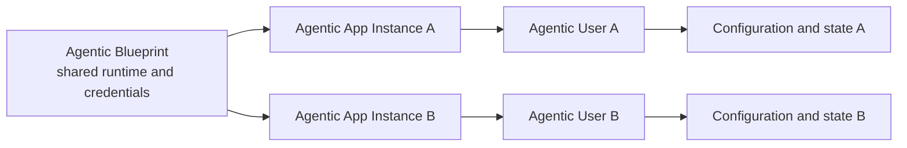
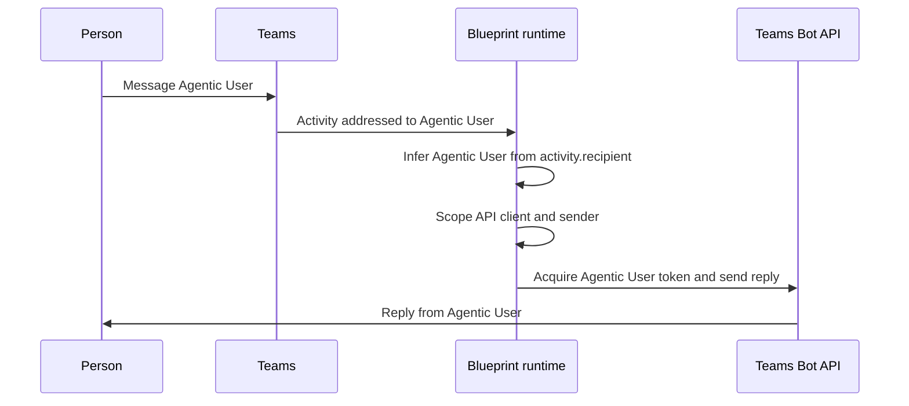
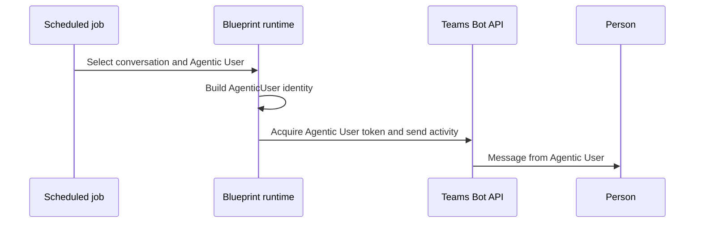

# Agent identity architecture

:::warning[Preview]
This architecture describes the current preview model. Do not depend on preview names or wire fields remaining unchanged.
:::

## Identity relationship



The blueprint proves that the hosted runtime is trusted to operate concrete agent instances. The Agentic App Instance identifies which instance is acting. The Agentic User supplies the user-shaped identity used for Teams messaging.

## Identifier glossary

| SDK or wire field | Meaning |
| --- | --- |
| Blueprint client ID | The reusable blueprint application's client ID. |
| `agenticAppInstanceId` | The concrete Agentic App Instance used during token exchange. |
| `agenticUserId` | The Agentic User's Entra object ID. |
| `agenticBlueprintId` | The blueprint ID associated with the instance. |
| `tenantId` | The tenant used for token acquisition and routing. |
| `activity.recipient.agenticAppId` | Wire representation of the Agentic App Instance ID. |
| `activity.recipient.agenticAppBlueprintId` | Wire representation of the blueprint ID. |

## Reactive flow



The SDK derives the Agentic User when the recipient contains `agenticAppId` and `agenticUserId`. It also copies these optional fields when available:

- `agenticAppId`
- `agenticUserId`
- `agenticAppBlueprintId`
- `tenantId`

The handler continues to use the normal `send`, `reply`, and `api` context properties. The scoped identity is applied internally.

## Proactive flow

There is no inbound activity from which to infer an identity during proactive work. The application must provide both the target conversation and the Agentic User.

:::caution[Preview implementation blocker]
The current preview implementation selects Agentic User token acquisition but does not yet serialize the correct Agentic User sender envelope. Use this flow only as a description of the intended design until the sender behavior is fixed and validated.
:::



Store the Agentic App Instance ID, Agentic User ID, tenant ID, and conversation reference when they become available. Do not infer one Agentic User from another user's conversation.

## Token delegation chain

Agentic User token acquisition uses a three-step delegation chain:

```text
Blueprint credential
  -> Agentic App Instance assertion
  -> Agentic User assertion
  -> resource token
```

The blueprint credential proves that the runtime can operate the instance. The Agentic App Instance identifies the concrete instance. The Agentic User ID identifies the user-shaped actor for the final resource token.

For Teams messaging, the final resource is the cloud environment's Agentic User Bot API scope.

## Lifecycle events

Agentic User lifecycle notifications arrive at the same messaging endpoint as other Bot Framework activities:

```text
type      = event
name      = agentLifecycle
valueType = concrete lifecycle variant
```

Lifecycle delivery is asynchronous. Handlers must tolerate:

- Events arriving in a different order than their timestamps.
- Property updates arriving before the identity-created event.
- Duplicate delivery.
- Missing optional fields.
- Explicit `null` values in preview payloads.
- New lifecycle variants that an older SDK does not recognize.

Use the event version when present, persist processing state, and make handlers idempotent.

## Security boundaries

- Never send as the blueprint when an Agentic User is required.
- Never accept Agentic User IDs from an untrusted caller without authorization.
- Keep state isolated by tenant and Agentic User ID.
- Treat callback and Bot API service URLs as security-sensitive destinations.
- Validate service URLs against trusted platform configuration before attaching bearer tokens.
- Use separate credentials for administrative provisioning and runtime messaging when their permissions differ.
