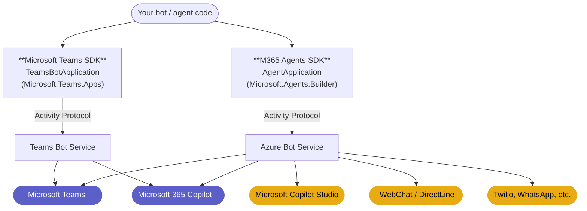

# Picking the right SDK for your Teams agent

Microsoft offers two supported, actively-developed SDKs that can build a bot or agent for Microsoft Teams:

- **[Microsoft 365 Agents SDK](https://github.com/Microsoft/Agents)**: a multi-channel agent runtime
- **Microsoft Teams SDK**: the SDK these docs cover, a Teams-first application framework

Both ship for **C#, TypeScript, and Python**. Both speak the Activity Protocol, both interoperate with Microsoft Entra, both support agentic identity via Agent365 (shipped in the M365 Agents SDK; coming soon to Teams SDK), and both reach Microsoft 365 Copilot. Microsoft positions both as first-class. Work done in either is portable in shape, and you are not locked into one path.

This page helps you pick the SDK whose **defaults** match the bot or agent you're building. The criteria are about *fit*, not gates: the two SDKs are converging on most capabilities, so we focus on durable differences.

## How they relate

The two SDKs target different backends (**Teams Bot Service** for the Microsoft Teams SDK, **Azure Bot Service** for the M365 Agents SDK), but speak the same **Activity Protocol** to reach them.

The channels then split into two groups:

- **Purple** (Microsoft Teams, Microsoft 365 Copilot): reachable from both SDKs. Basic features are at parity; for the premier Teams experience, use the Teams SDK.
- **Amber** (Microsoft Copilot Studio, WebChat / DirectLine, …): reachable from either SDK in principle, but the M365 Agents SDK is the recommended, optimized path.

## Which SDK for your Teams scenario

How Teams-deep does your bot need to go? Two paths:

- **Basic** is **breadth-focused**: Activity Protocol primitives that work uniformly across Teams, M365 Copilot, Copilot Studio, WebChat, and other channels. Best fit: the **M365 Agents SDK**.
- **Premier** is **depth-focused**: Teams-specific surfaces (mentions, message extensions, dialogs, tabs, meeting events, AI affordances, …) with dedicated handlers, schema types, and ergonomics. Best fit: the **Microsoft Teams SDK**.

### Basic experience: what you get with the M365 Agents SDK on Teams

The basic experience: Activity Protocol primitives that work uniformly across channels.

| Feature | Description |
|---|---|
| Text messages | Receive and reply |
| Typing indicators | Acknowledge a message is being processed |
| Streaming responses | Chunked output, useful for long or AI-generated messages |
| Conversation update events | Members added / removed |
| OAuth sign-in flow | Standard user authentication |
| Proactive messaging | Send unsolicited messages to a saved conversation |
| Adaptive Cards (basic) | Send cards and handle simple action callbacks |

### Premier experience: what you get with the Microsoft Teams SDK on Teams

Everything in the basic experience above, **plus** the premier Teams surface: dedicated handlers, schema types, and ergonomics for Teams-specific features.

| Feature | Description / API |
|---|---|
| @Mentions | `MessageActivity.addMention(...)`; `mention` activity route |
| Slash commands | Manifest-registered command lists invoked from the Teams compose box |
| Reactions | Add / remove emoji reactions on messages |
| Targeted (ephemeral) messages *(preview)* | `withRecipient(...)` to deliver to a specific user in a shared conversation |
| Quoted replies | Inbound parsing (`GetQuotedMessages()`), outbound auto-quote (`Reply()`), and quote-by-message-id (`Quote()`); see [`core/samples/Quoting`](https://github.com/microsoft/teams-sdk/tree/main/core/samples/Quoting) |
| Threaded replies | Reply to a specific message in a channel; channel reply chains |
| Message extensions | Search commands, link unfurling, action commands |
| Task modules / dialogs | `dialog.open` / `dialog.submit` (`task/fetch`, `task/submit`) |
| Tabs | Embedded SPAs with tab-to-bot RPC; configuration via `tab.open` / `tab.submit` |
| Meeting events | Start / end / participant join / leave |
| AI affordances | "Generated by AI" label, feedback loop, citation rendering |
| SSO / silent token exchange | Sign-in token exchange invokes |
| Channel events | Channel created / renamed / deleted, team member changes |
| File consent, read receipts, suggested actions, O365 connector card actions | Additional Teams-specific invokes |

> Rule of thumb: if your bot uses **most** of the Premier set, the Teams SDK is the right home; handlers and types are first-class. If it uses **few or none**, the M365 Agents SDK is sufficient.

## Bot Framework migration

If you're migrating from the **Bot Framework SDK** (the `Microsoft.Bot.*` packages), both SDKs offer a path. Pick based on whether you want to **modernize end-to-end** or **host legacy code unchanged**.

| | Migrate to M365 Agents SDK | Host legacy in Teams SDK |
|---|---|---|
| **What changes** | Package + namespace rename, `Program.cs` modernization, drop deprecated services | Add the compat package, register the adapter; existing handler unchanged |
| **Effort** | Medium (modernization scope, not a one-line swap) | Minimal (install + a few lines of registration) |
| **When to pick** | You want the modern SDK as your end state; you may need cross-channel reach later | You want legacy code running unchanged while you migrate incrementally (or never) |

## Next steps

- **Sticking with Teams SDK?** Continue to [Get started](/get-started/quickstart-register) or the [TypeScript](/typescript/getting-started) / [C#](/csharp/getting-started) / [Python](/python/getting-started) guides.
- **Need cross-channel reach?** Head to the [Microsoft 365 Agents SDK docs](https://learn.microsoft.com/en-us/microsoft-365/agents-sdk/).
- **Already using Bot Framework or TeamsFx?** See [Bot Framework migration](#bot-framework-migration) above; both SDKs offer migration paths.

:::tip Build for Teams *and* M365 Copilot at once
Both SDKs reach Microsoft 365 Copilot through the same Teams client surface. Once your bot works in Teams, [enable it in M365 Copilot](./enabling-in-copilot) with a single CLI command. No code change required.
:::
