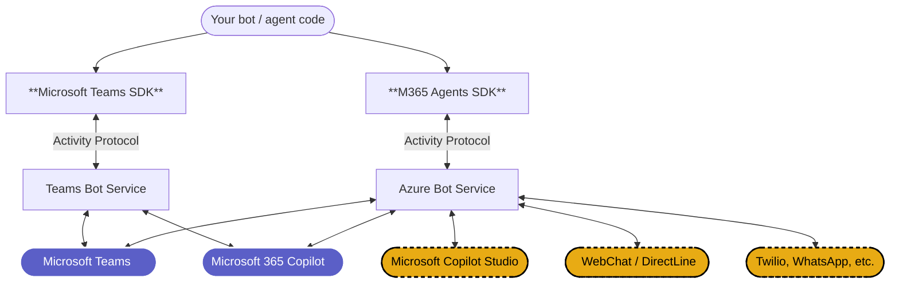

# Pick the right SDK for your Teams agent

Microsoft offers two supported, actively-developed SDKs that can build a bot or agent for Microsoft Teams:

- **[Microsoft Teams SDK](https://github.com/microsoft/teams-sdk)**: the SDK these docs cover, a Teams-first application framework
- **[Microsoft 365 Agents SDK](https://github.com/Microsoft/Agents)**: a multi-channel agent runtime that reaches Teams, M365 Copilot, Microsoft Copilot Studio, WebChat, and other surfaces

Both ship for **C#, TypeScript, and Python**. Both speak the Activity Protocol (the JSON wire format for bot/agent activities such as messages and events), both interoperate with Microsoft Entra, both support agentic identity via Agent365 (shipped in the M365 Agents SDK; coming soon to Teams SDK), and both reach Microsoft 365 Copilot. Microsoft positions both as first-class. You are not locked into one path; see [Bot Framework migration](#bot-framework-migration) below for what switching between them entails.

This doc helps you pick the SDK whose **defaults** match the bot or agent you're building. The criteria are about *fit*, not gates: the two SDKs are converging on most capabilities, so we focus on durable differences.

## Which SDK for your Teams scenario

How Teams-deep does your bot need to go? Two paths:

- **Cross-channel essentials** are **breadth-focused**: Activity Protocol primitives that work uniformly across Teams, M365 Copilot, Copilot Studio, WebChat, and other channels. Best fit: the **M365 Agents SDK**.
- **Teams-native collaboration** is **depth-focused**: the surfaces a bot needs to participate in group conversations the way Teams users expect (mentions, reactions, quoted replies, threaded replies, channel events, meetings experiences, citations, …). Best fit: the **Microsoft Teams SDK**.

### Cross-channel essentials: what you get with the M365 Agents SDK on Teams

Activity Protocol primitives that work uniformly across channels.

| Feature | Description |
|---|---|
| Text messages | Receive and reply |
| Typing indicators | Acknowledge a message is being processed |
| Streaming responses | Chunked output, useful for long or AI-generated messages |
| Conversation update events | Members added / removed |
| OAuth sign-in flow | Standard user authentication |
| Proactive messaging | Send unsolicited messages to a saved conversation |
| Adaptive Cards (basic) | Send cards and handle simple action callbacks |

### Teams-native collaboration: what you get with the Microsoft Teams SDK on Teams

Everything in the cross-channel essentials above, **plus** the Teams-native surface for **collaboration in group conversations**: the affordances your bot needs to participate in channels, chats, and meetings the way Teams users expect.

| Feature | Description |
|---|---|
| @Mentions | Mention a specific user in a message; receive a `mention` activity when the bot is mentioned |
| Reactions | Add / remove emoji reactions on messages |
| Targeted (ephemeral) messages *(preview)* | Deliver a message to a specific user in a shared conversation; other participants don't see it |
| Quoted replies | Parse incoming quoted-reply context; send replies that auto-quote the user's message or quote a specific message by ID |
| Threaded replies | Reply to a specific message in a channel; channel reply chains |
| Channel events | Channel created / renamed / deleted; team member changes |
| Meetings experiences | Meeting start / end and participant join / leave events |
| Citations | Render source citations on AI-generated messages |
| "Generated by AI" label | Show a visual indicator that a message came from an AI |
| Feedback loop | Capture user feedback (👍 / 👎) on AI messages |
| SSO / silent token exchange | Sign-in token exchange invokes |
| Slash commands | Manifest-registered command lists invoked from the Teams compose box |
| Task modules | Show a form in a pop-up; `dialog.open` / `dialog.submit` (`task/fetch`, `task/submit`) invokes |
| File consent, read receipts, suggested actions, O365 connector card actions | Additional Teams-specific invokes |
| Message extensions | Search commands, link unfurling, action commands |

> Rule of thumb: if your bot uses **most** of the Teams-native set above, the Teams SDK is the right home. If it uses **few or none**, the M365 Agents SDK is sufficient.

## How they relate

The two SDKs target different backends, but speak the same Activity Protocol to reach them.

- **Teams Bot Service** (Microsoft Teams SDK): the Teams-native runtime that handles bot traffic for Microsoft Teams and the M365 Copilot client surface directly.
- **Azure Bot Service** (M365 Agents SDK): the broader Bot Framework infrastructure that routes to Teams plus other channels (WebChat, DirectLine, etc.).

Messages flow in both directions along the lines shown: a user's turn rises from the channel up through the backend and SDK to your code, and your reply travels back down the same path.

The channels then split into two groups:

- **Microsoft Teams and Microsoft 365 Copilot** (solid borders in the diagram) are reachable from both SDKs. Cross-channel essentials are at parity; for Teams-native collaboration, use the Teams SDK.
- **Microsoft Copilot Studio, WebChat / DirectLine, and other Bot Framework Connector channels** (dashed borders in the diagram) are reachable from either SDK in principle, but the M365 Agents SDK is the recommended, optimized path.

## Bot Framework migration

If you're migrating from the **Bot Framework SDK** (the `Microsoft.Bot.*` packages), both SDKs offer a path. Pick based on whether you want to **modernize end-to-end** or **host legacy code unchanged**.

| | Migrate to M365 Agents SDK | Host legacy in Teams SDK |
|---|---|---|
| **What changes** | Package + namespace rename, `Program.cs` modernization, drop deprecated services | Add the compat package, register the adapter; existing handler unchanged |
| **Effort** | Medium (modernization scope, not a one-line swap) | Minimal (install + a few lines of registration) |
| **When to pick** | You want primitives preserved across a clean SDK switch; you may need cross-channel reach later | You want existing BotBuilder code running unchanged while you rewrite handlers piece by piece (or not at all) |

## Next steps

- **Sticking with Teams SDK?** Continue to [Get started](/get-started/quickstart-register) or the [TypeScript](/typescript/getting-started) / [C#](/csharp/getting-started) / [Python](/python/getting-started) guides.
- **Need cross-channel reach?** Head to the [Microsoft 365 Agents SDK docs](https://learn.microsoft.com/en-us/microsoft-365/agents-sdk/).
- **Already using Bot Framework or TeamsFx?** See [Bot Framework migration](#bot-framework-migration) above; both SDKs offer migration paths.

:::tip Build for Teams *and* M365 Copilot at once
Both SDKs reach Microsoft 365 Copilot through the same Teams client surface. Once your bot works in Teams, [enable it in M365 Copilot](./enabling-in-copilot) with a single CLI command, then republish or reload the app. No code change required.
:::
