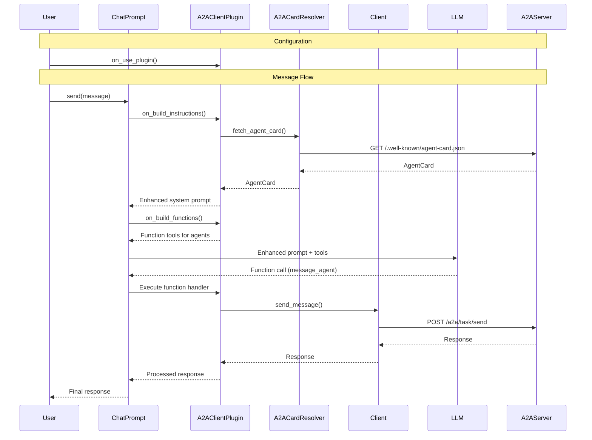

# A2A Client

## What is an A2A Client?

An A2A client is an agent or application that can proactively send tasks to A2A servers and interact with them using the A2A protocol.

## Using A2AClient Directly

For direct control over A2A interactions, you can use the `A2AClient` from the SDK:

```python
import uuid
from httpx import AsyncClient
from a2a.types import AgentCard, Message, Part, Role, Task, TextPart
from a2a.client import ClientFactory, Client
from a2a.client.card_resolver import A2ACardResolver
from a2a.client.client import ClientConfig
from .agent_client_info import AgentClientInfo
from .agent_config import AgentConfig

# Retrive the agent card based on the URL
async def fetch_agent_card(self, base_url: str, card_url: str) -> AgentCard:
    async with AsyncClient() as httpx_client:
      resolver = A2ACardResolver(httpx_client, base_url)
      card = await resolver.get_agent_card(card_url)
      return card

async def _get_client(self, key: str, config: AgentConfig) -> Client:
  try:
    # Example base_url=f"http://localhost:{PORT}/a2a"
    # Example card_url=".well-known/agent-card.json"
    card = await self.fetch_agent_card(base_url=config.base_url, card_url=config.card_url)
    client_config = ClientConfig()
    # Create the client from the URL
    client = ClientFactory(client_config).create(card=card)
    client_info = AgentClientInfo(**asdict(config), client=client, agent_card=card)
    self._clients.update({key: client_info})
    return client
  except Exception as e:
    self.log.error(f"Error creating client or fetching agent card for {key}: {e}")
    raise e

async def _send_message(self) -> None:
  # Send a message directly
  message = Message(
              message_id=str(uuid.uuid4()),
              role=Role("user"),
              parts=[Part(root=TextPart(kind="text", text="What is the weather?"))],
          )

  async for event in self._get_client().send_message(message):
    # Handle the event
```

## Using A2AClientPlugin with ChatPrompt

A2A is most effective when used with an LLM. The `A2AClientPlugin` can be added to your chat prompt to allow interaction with A2A agents. Once added, the plugin will automatically configure the system prompt and tool calls to determine if the a2a server is needed for a particular task, and if so, it will do the work of orchestrating the call to the A2A server.

```python
from os import getenv
from microsoft.teams.openai.completions_model import OpenAICompletionsAIModel
from microsoft.teams.a2a import A2AClientPlugin, A2APluginUseParams
from microsoft.teams.ai import ChatPrompt

PORT = getenv("PORT", "4000")

# Setup AI
def get_required_env(key: str) -> str:
    value = getenv(key)
    if not value:
        raise ValueError(f"Required environment variable {key} is not set")
    return value


AZURE_OPENAI_MODEL = get_required_env("AZURE_OPENAI_MODEL")
completions_model = OpenAICompletionsAIModel(model=AZURE_OPENAI_MODEL)

# Setup A2A Client Plugin
client_plugin = A2AClientPlugin()
# Specify the connection details for the agent we want to use
client_plugin.on_use_plugin(
    A2APluginUseParams(
        key="my-weather-agent", base_url=f"http://localhost:{PORT}/a2a", card_url=".well-known/agent-card.json"
    )
)
prompt = ChatPrompt(
    model=completions_model,
    plugins=[client_plugin],
)
```

To send a message:

```python
# Now we can send the message to the prompt and it will decide if
# the a2a agent should be used or not and also manages contacting the agent
result = await prompt.send(message)
```

### Advanced A2AClientPlugin Configuration

You can customize how the client interacts with A2A agents by providing custom builders:

```python
# Example with custom message builders and response processors
def build_function_metadata(card: AgentCard) -> FunctionMetadata:
    return FunctionMetadata(
        name=f"ask{re.sub(r'\s+', '', card.name)}",
        description=f"Ask {card.name} about {card.description or 'anything'}",
    )


def build_message_for_agent(data: BuildMessageForAgentMetadata) -> Union[Message, str]:
    # Return a string - will be automatically wrapped in a Message
    return f"[To {data.card.name}]: {data.input}"

    # Uncomment the following block to return a full Message object
    # message = Message(
    #                 kind='message',
    #                 message_id=str(uuid4()),
    #                 role=Role('user'),
    #                 parts=[Part(root=TextPart(kind='text', text=f"[To {data.card.name}]: {data.input}"))],
    #                 metadata={"source": "chat-prompt", **(data.metadata if data.metadata else {})}
    #             )
    # return message


def build_message_from_agent_response(data: BuildMessageFromAgentMetadata) -> str:
    if isinstance(data.response, Message):
        text_parts: List[str] = []
        for part in data.response.parts:
            if getattr(part.root, "kind", None) == "text":
                text_part = cast(TextPart, part.root)
                text_parts.append(text_part.text)
        return f"{data.card.name} says: {' '.join(text_parts)}"
    return f"{data.card.name} sent a non-text response."


## Advanced A2AClientPlugin
advanced_plugin = A2AClientPlugin(
    # Custom function metadata builder
    build_function_metadata=build_function_metadata,
    # Custom message builder - can return either Message or string
    build_message_for_agent=build_message_for_agent,
    # Custom response processor
    build_message_from_agent_response=build_message_from_agent_response,
)
advanced_plugin.on_use_plugin(
    A2APluginUseParams(
        key="my-weather-agent", base_url=f"http://localhost:{PORT}/a2a", card_url=".well-known/agent-card.json"
    )
)
advanced_prompt = ChatPrompt(model=completions_model, plugins=[advanced_plugin])
```


## Sequence Diagram

Here's how the A2A client works with `ChatPrompt` and `A2AClientPlugin`:



