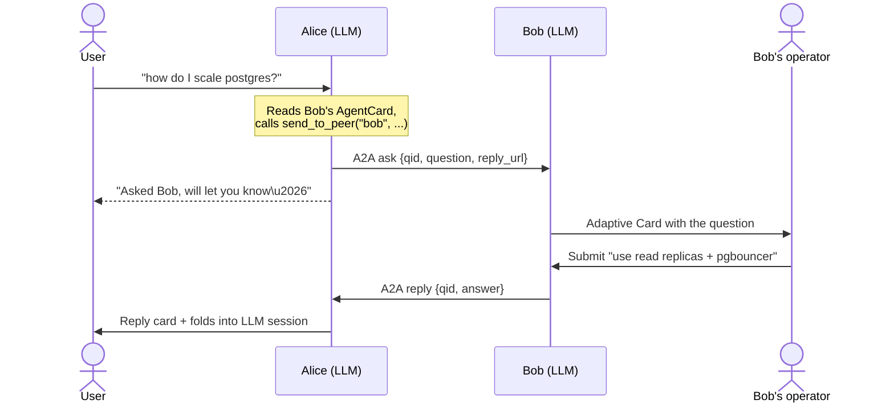

import Tabs from '@theme/Tabs';
import TabItem from '@theme/TabItem';

# Bot-to-Bot with A2A

Most agents either talk to **users** (a chat bot) or to **systems** (tools, APIs, MCP servers). [Agent2Agent (A2A)](https://a2a-protocol.org/) defines a third option: agents talking to **other agents** as peers, each with its own model, tools, and \u2014 in this case \u2014 its own audience of humans.

This guide builds the canonical example: two Teams bots, **Alice** and **Bob**, each with an LLM agent and a human operator. A user asks Alice a question; Alice's model reads Bob's published `AgentCard`, decides Bob's expertise fits better, and forwards the question over A2A. Bob's bot pushes an Adaptive Card to *his* operator, who answers. The answer flows back over A2A and lands in the user's chat with Alice \u2014 along with a context note so the next LLM turn knows what was said.

The architecture rests on three layers:

- **Teams SDK** \u2014 the bots' chat surfaces and operator UIs.
- **[Microsoft Agent Framework](https://github.com/microsoft/agent-framework)** \u2014 each bot's LLM agent, with one tool: `send_to_peer`.
- **[a2a-sdk](https://github.com/a2aproject/a2a-python)** \u2014 the wire protocol between bots. One Starlette sub-app, mounted next to `/api/messages` on the same FastAPI server.

Full runnable source: [examples/a2a-test](https://github.com/microsoft/teams.py/tree/main/examples/a2a-test).

## How it flows



## Install

```bash
pip install "a2a-sdk[core,http-server]" agent-framework microsoft-teams-apps uvicorn httpx
```

You need **two** Teams bot registrations \u2014 one per bot \u2014 and an Azure OpenAI resource. Each bot also gets its own port (`3978` for Alice, `3979` for Bob in the sample).

## Modeling the wire protocol

A2A carries opaque `DataPart` payloads; you decide their shape. Define both directions as Pydantic models with a `kind` discriminator so the executor never touches a raw dict:

```python
# messages.py
from typing import Annotated, Literal, Union
from pydantic import BaseModel, Field, TypeAdapter

class AskMessage(BaseModel):
    kind: Literal["ask"] = "ask"
    qid: str
    question: str
    sender: str
    reply_url: str   # where the responder should send the answer

class ReplyMessage(BaseModel):
    kind: Literal["reply"] = "reply"
    qid: str
    answer: str
    responder: str

A2AMessage = Annotated[Union[AskMessage, ReplyMessage], Field(discriminator="kind")]
A2AMessageAdapter: TypeAdapter[A2AMessage] = TypeAdapter(A2AMessage)
```

The `qid` correlates an ask with its reply across an asynchronous human round-trip. The `reply_url` lets the responder call back to the *exact* bot that asked \u2014 which sounds dangerous (and is, in production), but the sample validates it against an allowlist before trusting it.

## Sending and receiving over A2A

This is the most code-heavy part of the sample. Instead of one big snippet, look at it from each end of the wire.

<Tabs>
<TabItem value="send" label="Sending an ask" default>

The agent's only tool is `send_to_peer`. The LLM sees one tool, picks a peer name and a question, and the tool fires a single A2A message and returns immediately \u2014 the reply will come back asynchronously as a separate inbound call.

```python
# agent.py (excerpt)
from agent_framework import tool
from a2a_client import send_a2a
from messages import AskMessage

@tool
async def send_to_peer(peer: str, question: str) -> str:
    """Forward a question to a peer agent over A2A."""
    peer_url = self._peers[peer]
    qid = str(uuid.uuid4())
    user_conv_id = current_user_conv_id.get()  # ContextVar, set per turn
    self._state.awaiting_reply[qid] = {"conv_id": user_conv_id, "question": question}
    msg = AskMessage(qid=qid, question=question, sender=self._self_name,
                     reply_url=self._self_a2a_url)
    await send_a2a(peer_url, msg.model_dump())
    return f"Queued question to {peer}. Their reply will arrive separately."
```

The wire-level send is a one-shot client built from the peer's `AgentCard`:

```python
# a2a_client.py (excerpt)
from a2a.client import A2ACardResolver, ClientConfig, ClientFactory
from a2a.types import DataPart, Message, Part, Role

async def send_a2a(peer_url: str, data: dict) -> None:
    async with httpx.AsyncClient(timeout=60.0) as http_client:
        peer_card = await A2ACardResolver(http_client, peer_url).get_agent_card()
        client = ClientFactory(ClientConfig(httpx_client=http_client, streaming=True)).create(peer_card)
        request = Message(message_id=str(uuid.uuid4()), role=Role.user,
                          parts=[Part(root=DataPart(data=data))])
        async for _ in client.send_message(request):
            pass  # peer just acks; the real answer comes back on a separate call
```

</TabItem>
<TabItem value="receive" label="Receiving an ask">

A2A delivers incoming messages to an `AgentExecutor`. Branch on `kind`, validate, stash, and push the question to your operator as an Adaptive Card.

```python
# a2a_executor.py (excerpt)
from a2a.server.agent_execution import AgentExecutor

class AskReplyExecutor(AgentExecutor):
    async def execute(self, context, event_queue):
        message = parse_a2a_message(context.message)  # validates against AskMessage | ReplyMessage
        if isinstance(message, AskMessage):
            await self._on_ask(message)
        elif isinstance(message, ReplyMessage):
            await self._on_reply(message)
        # ... ack the task as completed (every A2A task needs a terminal event)

    async def _on_ask(self, msg: AskMessage) -> None:
        if not is_allowed_peer(msg.reply_url, self._allowed_peer_urls):
            return  # demo allowlist; production should use bearer tokens / mTLS
        self._state.inbound_asks[msg.qid] = {
            "reply_url": msg.reply_url, "sender": msg.sender, "question": msg.question,
        }
        await self._teams_app.send(
            self._state.operator_conv_id,
            ask_card(sender=msg.sender, question=msg.question, qid=msg.qid),
        )
```

The card carries only `qid` in its submit data \u2014 routing is resolved server-side from `inbound_asks` so a tampered card can't redirect a reply to an attacker's URL.

</TabItem>
<TabItem value="reply" label="Returning the reply">

When the operator clicks **Send reply**, the bot's card-action handler looks up the original `reply_url` by `qid` and fires another A2A message back:

```python
# bot_a.py (excerpt)
from messages import ReplyMessage

@app.on_card_action_execute(ASK_REPLY_ACTION)
async def handle_reply_submit(ctx) -> AdaptiveCardInvokeResponse:
    qid = ctx.activity.value.action.data.get("qid", "")
    answer_text = ctx.activity.value.action.data.get("answer", "")
    pending = state.inbound_asks.pop(qid, None)
    if pending is None:
        return AdaptiveCardActionMessageResponse(value="No matching ask.")
    reply = ReplyMessage(qid=qid, answer=answer_text, responder=NAME)
    await send_a2a(pending["reply_url"], reply.model_dump())
    return AdaptiveCardActionMessageResponse(value=f"Reply sent to {pending['sender']}.")
```

On the other side, that lands as a `ReplyMessage` in the executor's `_on_reply`, which pops the original `awaiting_reply` entry and pushes a reply card into the user's conversation \u2014 closing the loop.

</TabItem>
</Tabs>

## Folding the reply into the LLM's memory

Pushing a reply card to the user is half the job. The other half is making sure the *next* time the user follows up (`"and what did Bob suggest about indexes?"`), the model has the answer in context.

The trick: append a note to the user's `AgentSession` history as a synthetic user-role message. Most providers accept arbitrary user-role context mid-conversation; multiple system messages are sometimes rejected.

```python
# agent.py (excerpt)
def record_peer_reply(self, user_conv_id, responder, question, answer):
    session = self._sessions.get(user_conv_id)
    if session is None:
        return
    note = f"[peer update] {responder} replied: {answer!r} (to: {question!r})."
    store = session.state.setdefault(InMemoryHistoryProvider.DEFAULT_SOURCE_ID, {})
    store.setdefault("messages", []).append(Message("user", [note]))
```

The executor calls this hook (passed into `make_a2a_app(..., on_peer_reply=...)`) whenever a peer reply arrives. From the LLM's perspective, the peer answer is just another message in the thread.

## Wiring it up

Each bot runs Teams + A2A on **one** uvicorn process. Mount the A2A Starlette sub-app at `/a2a` on the shared FastAPI instance, then start the Teams app on the same port.

<Tabs>
<TabItem value="a2a" label="The A2A app" default>

`make_a2a_app` builds an `A2AStarletteApplication` with an `AgentCard` (what peers see when they call `A2ACardResolver`) and the executor:

```python
# a2a_server.py (excerpt)
from a2a.server.apps.jsonrpc.starlette_app import A2AStarletteApplication
from a2a.types import AgentCapabilities, AgentCard, AgentSkill

def make_a2a_app(*, teams_app, state, description, skill, url,
                 allowed_peer_urls, on_peer_reply=None):
    agent_card = AgentCard(
        name=state.name,
        description=description,         # <- peers' LLMs read this to decide when to forward
        url=url,
        version="1.0.0",
        protocol_version="0.3.0",
        capabilities=AgentCapabilities(streaming=True),
        skills=[AgentSkill(id=skill, name=skill, description=description, tags=[skill])],
    )
    handler = DefaultRequestHandler(
        agent_executor=AskReplyExecutor(teams_app, state, allowed_peer_urls, on_peer_reply),
        task_store=InMemoryTaskStore(),
    )
    return A2AStarletteApplication(agent_card=agent_card, http_handler=handler)
```

The `description` is the contract that lets the *other* bot's LLM decide whether to forward something to you. Treat it like a tool docstring: short, specific, focused on what your bot is good at answering.

</TabItem>
<TabItem value="bot" label="The bot entry point">

```python
# bot_a.py (excerpt) \u2014 bot_b.py is symmetric on port 3979
fastapi_app = FastAPI()
app = App(http_server_adapter=FastAPIAdapter(app=fastapi_app), client_id=..., ...)
state = BotState(name="Alice")
bot_agent = BotAgent(self_name="Alice", self_a2a_url=SELF_A2A_URL,
                     peers={"bob": BOB_URL}, state=state)

@app.on_message
async def handle_message(ctx):
    if ctx.activity.conversation.conversation_type == "personal":
        state.operator_conv_id = ctx.activity.conversation.id
    agent = await bot_agent.get_agent()
    session = bot_agent.session_for(ctx.activity.conversation.id)
    current_user_conv_id.set(ctx.activity.conversation.id)
    async for chunk in agent.run(ctx.activity.text or "", session=session, stream=True):
        if chunk.text:
            ctx.stream.emit(chunk.text)

async def main():
    a2a_app = make_a2a_app(teams_app=app, state=state, description=DESCRIPTION,
                            skill="ask_reply", url=SELF_A2A_URL,
                            allowed_peer_urls=[BOB_URL],
                            on_peer_reply=bot_agent.record_peer_reply)
    fastapi_app.mount("/a2a", a2a_app.build())
    await app.initialize()
    await uvicorn.Server(uvicorn.Config(fastapi_app, host=HOST, port=PORT)).serve()
```

Order matters here too: `app.initialize()` registers `/api/messages` *before* `await server.serve()` starts accepting traffic. The A2A mount goes under `/a2a/`, so the two never collide.

</TabItem>
</Tabs>

## A note on trust

The `is_allowed_peer` check in this sample compares scheme/host/port against a configured allowlist. That's a **demo-only** stand-in for authorization \u2014 a self-declared `reply_url` is exactly as trustworthy as the network it came from. Production A2A should authenticate the caller with a bearer token signed by an IdP, or use mTLS. The bot identity comes from the network, not the message body.

## Where to go next

The full sample \u2014 both bots, all helper modules, and the symmetric Adaptive Cards \u2014 lives in [`microsoft/teams.py/examples/a2a-test`](https://github.com/microsoft/teams.py/tree/main/examples/a2a-test). For agents that talk to *non-Teams* services instead of other Teams bots, see [Exposing Teams to AI Agents (MCP)](./mcp-server) for the inverse pattern (agent calls **into** Teams) or [AI Agents with Tools](./agent-framework) for the standalone-agent baseline.
