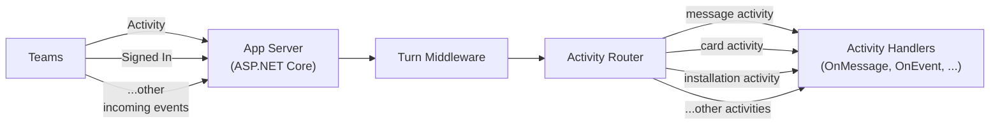
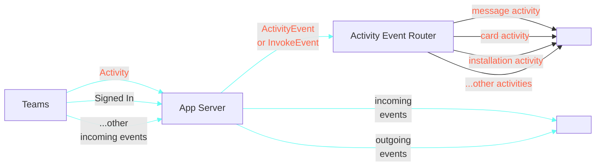

import Language from '@site/src/components/Language';

# Essentials

<Language language="csharp">

At its core, an application that hosts an agent on Microsoft Teams exists to do three things well: listen to **activities**, handle the ones that matter, and respond efficiently. Whether a user sends a message, opens a dialog, or clicks a button — your app is there to interpret the activity and act on it.

With Teams SDK, we've made it easier than ever to build this kind of reactive, conversational logic. The SDK gives you simple, strongly-typed handlers to connect to Teams, react to activities, and build intelligent agent behaviors quickly.

</Language>

<Language language={['typescript', 'python']}>

At its core, an application that hosts an agent on Microsoft Teams exists to do three things well: listen to events, handle the ones that matter, and respond efficiently. Whether a user sends a message, opens a dialog, or clicks a button — your app is there to interpret the event and act on it.

With Teams SDK, we've made it easier than ever to build this kind of reactive, conversational logic. The SDK introduces a few simple but powerful paradigms to help you connect to Teams, register handlers, and build intelligent agent behaviors quickly.

</Language>

Before diving in, let's define a few key terms:

<LanguageInclude section="key-terms" />

<Language language="csharp">

In the **2.1 preview**, your app is a standard ASP.NET Core application. Incoming activities from Teams arrive at your app's endpoint, pass through any **turn middleware** you register, and are routed to the dedicated **activity handler** (`OnMessage`, `OnEvent`, `OnMembersAdded`, …) that matches.

:::note[SDK 2.0 (Legacy)]
SDK 2.0 routed both incoming and outgoing events through a **plugin event bus** before they reached your handlers. The 2.1 preview removes plugins in favor of standard ASP.NET Core **middleware** and **dependency injection**.
:::

</Language>

<Language language={['typescript', 'python']}>

</Language>

This section will walk you through the foundational pieces needed to build responsive, intelligent agents using the SDK.
