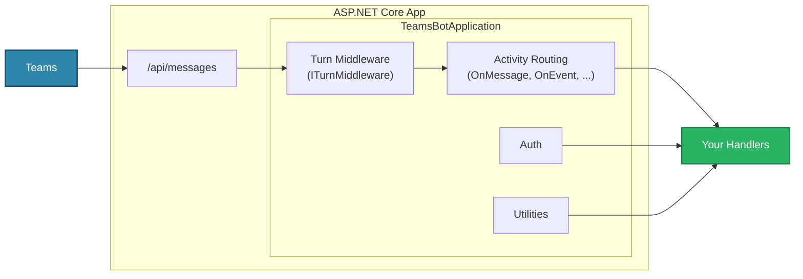
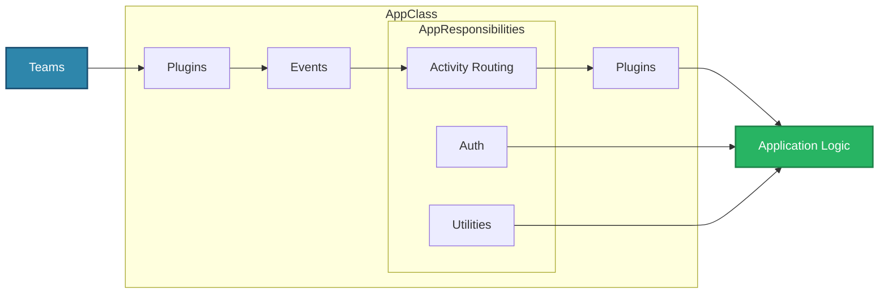

import Language from '@site/src/components/Language';

# App Basics

<Language language="csharp">

The app is the main entry point for your agent. In the **Teams SDK for .NET 2.1** preview it is a `TeamsBotApplication`, built on top of a standard ASP.NET Core web application. You register it at startup with `builder.Services.AddTeamsBotApplication()` and expose it as your bot's HTTP endpoint with `app.UseTeamsBotApplication()` — see the [quickstart](../getting-started/quickstart) or [code basics](../getting-started/code-basics) for the full setup.

It is responsible for:

1. Hosting and running the server (via ASP.NET Core / Kestrel)
2. Serving incoming requests on `/api/messages` and routing them to your handlers
3. Handling authentication for your agent to the Teams backend (via your `AzureAd` configuration)
4. Providing helpful utilities which simplify interacting with the Teams platform (`context.SendAsync`, `context.ReplyAsync`, the API client, etc.)
5. Letting you extend behavior with standard ASP.NET Core **middleware** and **dependency injection**

## Core Components

**Hosting (ASP.NET Core)**

- Runs the web server (Kestrel) and exposes your bot at `/api/messages`
- Managed with the standard host lifecycle (`IHostApplicationLifetime` for start/stop)

**Activity Routing**

- Routes incoming activities to the appropriate typed handler (`OnMessage`, `OnEvent`, `OnMembersAdded`, `OnInstall`, …)

**Turn Middleware**

- Cross-cutting logic that runs on every turn (logging, metrics, etc.)
- Implement `ITurnMiddleware` and register it with `teams.UseMiddleware(...)`

**Utilities**

- Convenience methods for interacting with Teams (`context.SendAsync`, `context.ReplyAsync`, `context.TypingAsync`, the `context.Api` client, and streaming)

**Auth**

- Handles authenticating your agent with the Teams backend using your `AzureAd` configuration
- Validates inbound tokens before any handler runs (see [Trust Model](app-authentication/trust-model))

**Dependency Injection**

- Register your own services in `builder.Services` and inject them into handlers and middleware, just like any ASP.NET Core app

:::note[SDK 2.0 (Legacy)]
The SDK 2.0 model exposed the app as an `App` class with a **plugin architecture** — plugins sat both in front of the app (hosting it as a server) and behind it (reacting to activities being sent), and communicated through an event bus. The 2.1 preview **removes plugins** in favor of ASP.NET Core middleware and dependency injection. If you're upgrading from Bot Framework or 2.0 patterns, see the [BotBuilder migration guide](../migrations/botbuilder). The plugin-based model is still described below for the TypeScript and Python SDKs.
:::

</Language>

<Language language={['typescript', 'python']}>

The `App` class is the main entry point for your agent.

It is responsible for:

1. Hosting and running the server (via plugins)
2. Serving incoming requests and routing them to your handlers
3. Handling authentication for your agent to the Teams backend
4. Providing helpful utilities which simplify the ability for your application to interact with the Teams platform
5. Managing plugins which can extend the functionality of your agent

## Core Components

**Plugins**

- Can be used to set up the server
- Can listen to messages or send messages out

**Events**

- Listens to events from core plugins
- Emit interesting events to the application

**Activity Routing**

- Routes activities to appropriate handlers

**Utilities**

- Provides utility functions for convenience (like sending replies or proactive messages)

**Auth**

- Handles authenticating your agent with Teams, Graph, etc.
- Simplifies the process of authenticating your app or user for your app

**Plugins (Secondary)**

- Can hook into activity handlers or proactive scenarios
- Can modify or update agent activity events

## Plugins

You'll notice that plugins are present in the front, which exposes your application as a server, and also in the back after the app does some processing to the incoming message. The plugin architecture allows the application to be built in an extremely modular way. Each plugin can be swapped out to change or augment the functionality of the application. The plugins can listen to various events that happen (e.g. the server starting or ending, an error occuring, etc), activities being sent to or from the application and more. This allows the application to be extremely flexible and extensible.

</Language>
