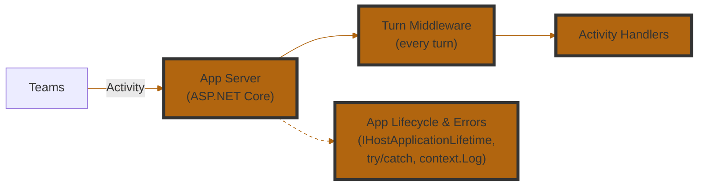

import Tabs from '@theme/Tabs';
import TabItem from '@theme/TabItem';

# Middleware & Error Handling

**Turn middleware** is how a 2.1 app runs logic on *every* activity it receives — before that activity reaches your handlers. It's the 2.1 replacement for much of what plugins did in 2.0: cross-cutting concerns like logging, metrics, and request enrichment. Because your app is a standard ASP.NET Core application, other concerns — app lifecycle (startup/shutdown) and errors — are handled with familiar building blocks (`IHostApplicationLifetime`, `try`/`catch`, `context.Log`).



If you're coming from SDK 2.0, the plugin event bus is gone. The table below maps each thing you used to handle onto its 2.1 mechanism:

<Tabs groupId="csharp-sdk-version" defaultValue="core">
<TabItem value="legacy" label="SDK 2.0 (Legacy)">

| **Event Name**      | **Description**                                                                |
| ------------------- | ------------------------------------------------------------------------------ |
| `start`             | Triggered when your application starts. Useful for setup or boot-time logging. |
| `signin`            | Triggered during a sign-in flow via Teams.                                     |
| `error`             | Triggered when an unhandled error occurs in your app. Great for diagnostics.   |
| `activity`          | A catch-all for incoming Teams activities (messages, commands, etc.).          |
| `activity.response` | Triggered when your app sends a response to an activity. Useful for logging.   |
| `activity.sent`     | Triggered when an activity is sent (not necessarily in response).              |

</TabItem>
<TabItem value="core" label="SDK 2.1 (Preview)">

In the 2.1 preview there is no separate plugin event bus. Instead, these concerns map onto standard .NET building blocks:

| **What you want to react to** | **How you handle it in 2.1** |
| ----------------------------- | ---------------------------- |
| Cross-cutting logic on every turn (logging, metrics, enrichment) | **Turn middleware** — implement `ITurnMiddleware` and register with `teams.UseMiddleware(...)` |
| Incoming Teams activity       | Dedicated handlers (`OnMessage`, `OnMembersAdded`, `OnInstall`, …) or `OnEvent` for custom event activities |
| App start / stop              | ASP.NET Core `IHostApplicationLifetime` (`ApplicationStarted`, `ApplicationStopping`) |
| Sign-in completed / failed    | `teams.GetOAuthFlow(name).OnSignInComplete(...)` / `OnSignInFailure(...)` |
| Unhandled error in a handler  | `try`/`catch` with `context.Log`, or standard ASP.NET Core exception handling (`BotHandlerException` wraps the failure) |

</TabItem>
</Tabs>

## Turn middleware

Turn middleware runs on every incoming activity, in registration order, before your activity handlers. Implement `ITurnMiddleware` — do your work, then call `nextTurn` to pass control down the pipeline — and register it with `teams.UseMiddleware(...)`. This is the right place for logging, metrics, or any logic that should apply to the whole app.

For example, to observe (a catch-all) and log every incoming activity:

<Tabs groupId="csharp-sdk-version" defaultValue="core">
<TabItem value="legacy" label="SDK 2.0 (Legacy)">

When an activity is received, log its `JSON` payload.

```csharp
app.OnActivity((sender, @event) =>
{
    app.Logger.Info(@event.Activity.ToString());
});
```

</TabItem>
<TabItem value="core" label="SDK 2.1 (Preview)">

```csharp
using Microsoft.Teams.Apps;
using Microsoft.Teams.Core;
using Microsoft.Teams.Core.Schema;

internal class ActivityLoggingMiddleware : ITurnMiddleware
{
    public async Task OnTurnAsync(
        BotApplication botApplication,
        CoreActivity activity,
        NextTurn nextTurn,
        CancellationToken cancellationToken = default)
    {
        // When an activity is received, log its payload.
        Console.WriteLine(activity.ToString());
        await nextTurn(cancellationToken);
    }
}
```

Register it during startup:

```csharp
teams.UseMiddleware(new ActivityLoggingMiddleware());
```

</TabItem>
</Tabs>

## Handling errors

<Tabs groupId="csharp-sdk-version" defaultValue="core">
<TabItem value="legacy" label="SDK 2.0 (Legacy)">

```csharp
app.OnError((sender, @event) =>
{
    // do something with the error
    app.Logger.Info(@event.Exception.ToString());
});
```

</TabItem>
<TabItem value="core" label="SDK 2.1 (Preview)">

Handle errors where they occur and log them through `context.Log`:

```csharp
teams.OnMessage(async (context, cancellationToken) =>
{
    try
    {
        // ... your handler logic
    }
    catch (Exception ex)
    {
        // do something with the error
        context.Log.Error(ex.ToString());
    }
});
```

For app-wide error handling, use standard ASP.NET Core exception-handling middleware — failures during activity processing surface as a `BotHandlerException` that wraps the original exception and the offending activity.

</TabItem>
</Tabs>
