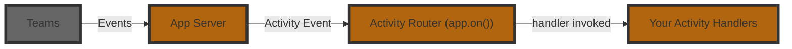

# Listening To Activities

An **Activity** is the Teams‑specific payload that flows between the user and your bot.
Where _events_ describe high‑level happenings inside your app, _activities_ are the raw Teams messages such as chat text, card actions, installs, or invoke calls.

<LanguageInclude section="intro" />



Here is an example of a basic message handler:

<LanguageInclude section="basic-example" />

<LanguageInclude section="example-explanation" />

## Slash Commands

:::info[Preview]
Slash commands are coming soon in May 2026.
:::

Slash commands are manifest-declared commands users run from the compose box. To enable slash commands, set `supportsTargetedMessages: true` in your app manifest under the `bots` section. You can opt in with an explicit command list by declaring specific commands using `commandLists` with `triggers: ["slash"]`, which Teams shows in the slash menu when a user types `/`. Without a command list, users can still invoke your agent via `/agent-name` and provide free-form input.

```json
{
  "bots": [
    {
      "botId": "{{BOT_ID}}",
      "scopes": ["personal", "team", "groupChat"],
      "supportsTargetedMessages": true,
      "commandLists": [
        {
          "scopes": ["team", "groupChat"],
          "triggers": ["slash"],
          "commands": [
            { "title": "Review", "description": "Review a document" }
          ]
        }
      ]
    }
  ]
}
```

When a user sends a slash command, it appears as a private message visible only to them. Your agent can reply privately or, when appropriate, share a response with the broader group or channel.

Slash commands arrive as normal message activities with the targeted flag set on the activity's recipient object.

<LanguageInclude section="slash-command-example" />

## Middleware pattern

<LanguageInclude section="middleware-intro" />

<LanguageInclude section="middleware-examples" />

:::info
Just like other middlewares, if you stop the chain by not calling `next()`, the activity will not be passed to the next handler. The order of registration for the handlers also matters as that determines how the handlers will be called.
:::

<LanguageInclude section="activity-reference-footer" />
