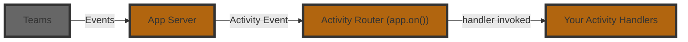

import Tabs from '@theme/Tabs';
import TabItem from '@theme/TabItem';
import Language from '@site/src/components/Language';

# Listening To Activities

An **Activity** is the Teams‑specific payload that flows between the user and your bot.
Where _events_ describe high‑level happenings inside your app, _activities_ are the raw Teams messages such as chat text, card actions, installs, or invoke calls.

<LanguageInclude section="intro" />


```mermaid
flowchart LR
    Teams["Teams"]:::less-interesting
    Server["App Server"]:::interesting
    ActivityRouter["Activity Router (app.on())"]:::interesting
    Handlers["Your Activity Handlers"]:::interesting

    Teams --> |Events| Server
    Server --> |Activity Event| ActivityRouter
    ActivityRouter --> |handler invoked| Handlers

    classDef interesting fill:#b1650f,stroke:#333,stroke-width:4px;
    classDef less-interesting fill:#666,stroke:#333,stroke-width:4px;
```

Here is an example of a basic message handler:

<LanguageInclude section="basic-example" />

<LanguageInclude section="example-explanation" />

## Slash Commands

:::info[Preview]
Slash commands are available in public preview. General availability is planned for a future release.
:::

Slash commands are manifest-declared commands users run from the compose box. To enable slash commands, set `supportsTargetedMessages: true` in your app manifest under the `bots` section. You can opt in with an explicit command list by declaring specific commands using `commandLists` with `triggers: ["slash"]`, which Teams shows in the slash menu when a user types `/`. Without a command list, users can still invoke your agent via `/agent-name` and provide free-form input.

```json
{
  "bots": [
    {
      "botId": "{{BOT_ID}}",
      "scopes": ["personal", "team", "groupChat"],
      "supportsTargetedMessages": true,
      "commandLists": [
        {
          "scopes": ["team", "groupChat"],
          "triggers": ["slash"],
          "commands": [
            { "title": "Review", "description": "Review a document" }
          ]
        }
      ]
    }
  ]
}
```

When a user sends a slash command, it appears as a private message visible only to them. Your agent can reply privately or, when appropriate, share a response with the broader group or channel.

Slash commands arrive as normal message activities with the targeted flag set on the activity's recipient object.

<LanguageInclude section="slash-command-example" />

## Activity handler chaining

How handlers flow depends on SDK version.

<Language language={['typescript', 'python']}>

:::info
In SDK 2.0, handlers are chained. Call `next()` to continue to the next matching handler; return without `next()` to stop the chain. Handler registration order controls execution order.
:::

</Language>

<Language language="csharp">

:::info
In the 2.1 preview, activity handlers are **not** a `next()`-style chain — all matching handlers run in their registration order, and one handler does not stop the others from running. To short-circuit or wrap the pipeline (for example to stop processing on a condition), use turn middleware (`ITurnMiddleware`) and control flow by whether you `await nextTurn(...)`.
:::

:::note[SDK 2.0 (Legacy)]
In SDK 2.0, activity handlers are chained. Call `context.Next()` to continue to the next matching handler; return without it to stop the chain. Registration order determines handler execution order.

```csharp
app.OnMessage(async (context, cancellationToken) =>
{
    if (context.Activity.Text == "/help")
    {
        await context.Send("Here are all the ways I can help you...", cancellationToken);
        return; // stop chain
    }

    await context.Next(); // continue chain
});

app.OnMessage(async (context, cancellationToken) =>
{
    await context.Send($"Hello! you said {context.Activity.Text}", cancellationToken);
});
```
:::

</Language>

<LanguageInclude section="activity-reference-footer" />
