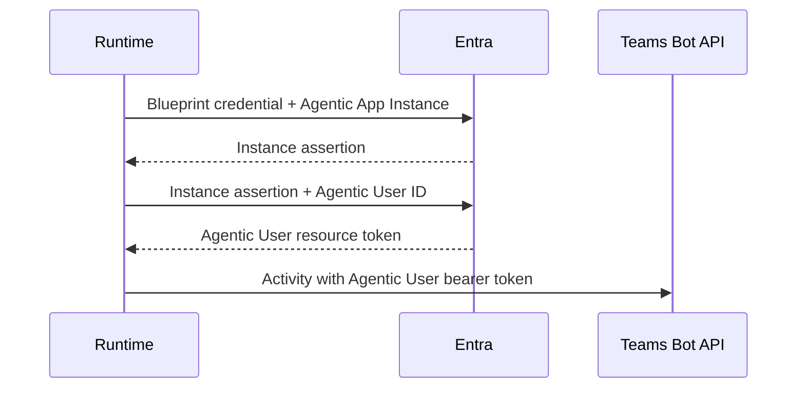

# Authenticate as an Agentic User

Agentic User messaging uses the blueprint credential to obtain a resource token for a concrete Agentic App Instance and Agentic User.

:::warning[Package availability]
These APIs are planned for a future TypeScript preview package. Add a concrete minimum package version here when the preview is published.
:::

## Configure the blueprint credential

<LanguageInclude section="environment" />

`CLIENT_ID` identifies the blueprint, not the concrete Agentic App Instance. The instance and user identifiers are supplied through `AgenticUser`.

The current TypeScript preview supports:

- Blueprint client credentials.
- A custom token provider that implements Agentic User token acquisition.

Do not assume that every authentication method supported for regular bot tokens can also mint Agentic User tokens.

## Delegation chain



Conceptually, the flow is:

```text
Blueprint -> Agentic App Instance -> Agentic User -> resource token
```

The SDK performs the exchange when a reactive context is scoped from the activity recipient or when a proactive operation receives an `AgenticUser`.

## Use a custom token provider

<LanguageInclude section="custom-token-provider" />

The provider must keep tokens isolated by scope, tenant, Agentic App Instance, and Agentic User. A cache key that omits any of those values can return a token for the wrong actor or resource.

## Security guidance

- Store blueprint credentials in a managed secret store.
- Prefer short-lived or federated credentials when the SDK flow supports them.
- Never log assertions or access tokens.
- Validate callback tokens before processing activities.
- Validate outbound service URLs before attaching bearer tokens.
- Authorize administrative callers before allowing them to choose an Agentic User.
