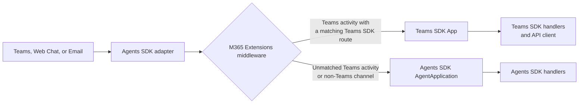

# M365 Extensions

M365 Extensions let you enable multichannel support without having to rewrite Teams-specific capabilities with an existing Microsoft Agents SDK `AgentApplication`. The extension creates a Teams SDK `App` that shares the Agents SDK app's identity and connections, then bridges the two routing systems.

Use the Teams SDK for Teams-native features such as targeted messages, reactions, dialogs, and quoted replies.

## How It Works

For each activity, the middleware first checks the channel. Non-Teams activities continue directly through the Agents SDK pipeline. For a Teams activity, the Teams SDK handles it only when a matching route exists; otherwise, the activity falls through to the Agents SDK app.

## How to Use It

<LanguageInclude section="setup" />

The bridge owns the Teams SDK app's identity configuration and outbound token provider. It derives them from the Agents SDK connection manager, so don't pass separate client ID, tenant ID, or token options.

Register Teams-specific routes on the returned Teams SDK app. Register multichannel routes on the original Agents SDK app.

## Scenarios

### Handle a Targeted Message with the Teams SDK

The Teams SDK app supports the same handlers as a standalone Teams SDK application. This handler sends an ephemeral response that only the sender can see:

<LanguageInclude section="targeted-message" />

For a complete targeted-message implementation, including inbound detection, updates, and deletion, see the <LanguageInclude section="targeted-message-sample-link" />.

### Call the Teams API Client from an Agents SDK Handler

An Agents SDK handler can reuse the bridged Teams SDK API client. Check that the activity came from Teams before calling a Teams-only API such as message reactions:

<LanguageInclude section="agents-sdk-reaction" />

This pattern keeps the route in the Agents SDK while using the same Teams credentials and HTTP configuration that the bridge established.

### Route Across Teams, Web Chat, and Email

M365 Extensions preserve the Agents SDK app's multichannel reach:

| Activity | Route |
| --- | --- |
| Teams activity matching a Teams SDK handler | Teams SDK |
| Teams activity without a matching Teams SDK handler | Agents SDK |
| Web Chat / Direct Line activity | Agents SDK |
| Email activity | Agents SDK |

The <LanguageInclude section="m365-extensions-sample-link" /> demonstrates all three channels. Its `help` command renders an Adaptive Card through the Teams SDK in Teams, while Web Chat and email receive the Agents SDK's text response. Teams-only commands such as `targeted` and `react` fall through on the other channels.

