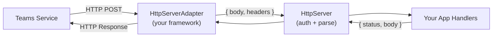

# Self-Managing Your Server

By default, `app.start()` spins up an HTTP server, registers the Teams endpoint, and manages the full lifecycle for you. Under the hood, the SDK uses <LanguageInclude section="default-framework" /> as its built-in HTTP framework. But if you need to self-manage your server — because you have an existing app, need custom server configuration (TLS, workers, middleware), or use a different HTTP framework — the SDK supports that through the `HttpServerAdapter` interface.

## How It Works

The SDK splits HTTP handling into two layers:

- **HttpServer** handles Teams protocol concerns: JWT authentication, activity parsing, and routing to your handlers.
- **HttpServerAdapter** handles framework concerns: translating between your HTTP framework's request/response model and the SDK's pure handler pattern.

The adapter interface is intentionally simple — implement `registerRoute` and the SDK handles the rest.

## The Adapter Interface

<LanguageInclude section="adapter-interface" />

- **`registerRoute`** — Required. Routes are registered dynamically (`/api/messages`, `/api/functions/{name}`, etc.).
- **`serveStatic`** — Optional. Only needed for tabs or static pages.
- **`start` / `stop`** — Optional. Omit when you manage the server lifecycle yourself.

## Self-Managing Your Server

To add Teams to an existing server:

1. Create your server with your own routes and middleware.
2. Wrap it in an adapter (or use the built-in one with your server instance).
3. Call `app.initialize()` — this registers the Teams routes on your server. Do **not** call `app.start()`.
4. Start the server yourself.

<LanguageInclude section="self-managed" />

## Using a Different Framework

If you use a framework other than the built-in default, implement the adapter interface for your framework. The core work is in `registerRoute` — translate incoming requests to `{ body, headers }`, call the handler, and write the response back. Since you manage the server lifecycle yourself, `start`/`stop` aren't needed. And `serveStatic` is only required if you serve tabs or static pages.

<LanguageInclude section="custom-adapter" />
